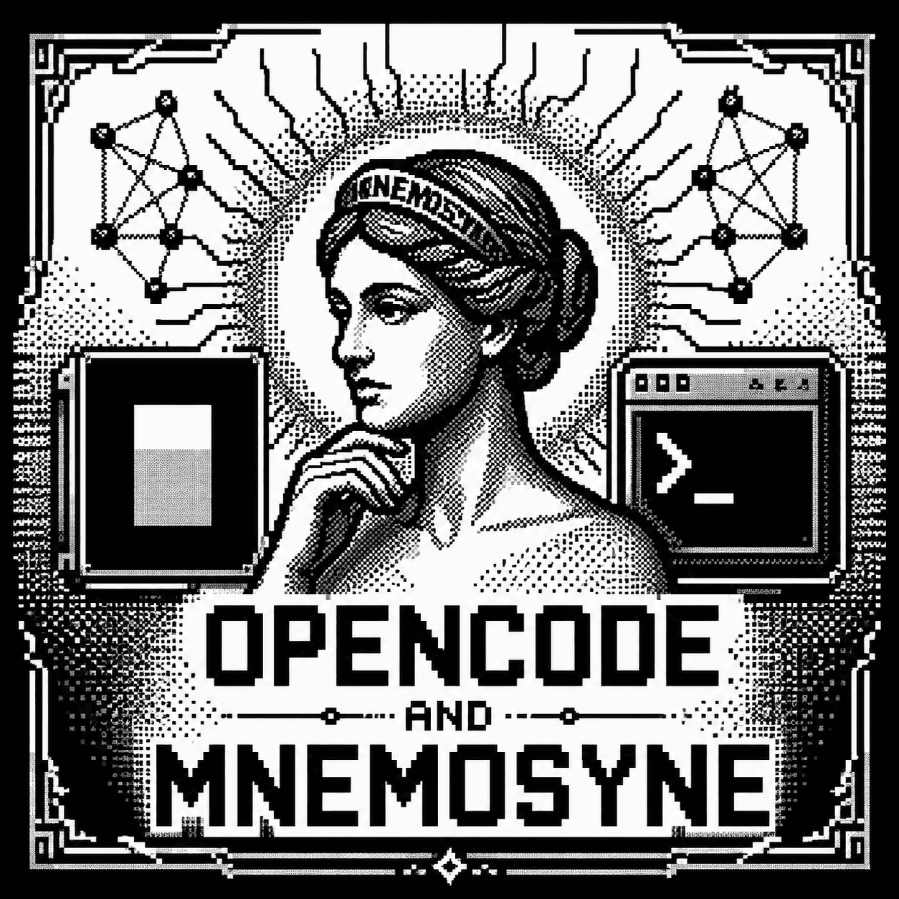

# opencode-mnemosyne-oss

<p align="center">
  
</p>

<p align="center">
  <a href="https://www.npmjs.com/package/opencode-mnemosyne-oss"></a>
  <a href="https://github.com/ArkhiMuttaqina/opencode-mnemosyne-oss/actions"></a>
  <a href="LICENSE"></a>
  <a href="https://github.com/mnemosyne-oss/mnemosyne"></a>
</p>

OpenCode plugin for **local persistent memory** using the official [Mnemosyne](https://github.com/mnemosyne-oss/mnemosyne). Gives your AI coding agent memory that persists across sessions -- entirely offline, no cloud APIs.

This is the local/offline alternative to cloud-based memory plugins like opencode-supermemory.

## Prerequisites

Install the official Mnemosyne package first:

```bash
pip install mnemosyne-memory

# With all features, including vector search and MCP server
pip install "mnemosyne-memory[all]"

# Upgrade an existing install
pip install --upgrade mnemosyne-memory
```

This plugin calls the installed `mnemosyne` CLI. It first honors `MNEMOSYNE_BIN`, then runs your interactive shell's `which mnemosyne` and auto-resolves that path into `MNEMOSYNE_BIN` for the plugin process. If your shell does not expose it, the plugin probes common install paths such as `~/.local/bin` and Conda locations like `~/miniconda3/bin`. See the [official Mnemosyne README](https://github.com/mnemosyne-oss/mnemosyne#quick-start) for detailed setup instructions. On first use, mnemosyne may download its local ML models.

If OpenCode runs with a narrower `PATH` than your interactive shell, set an explicit binary path:

```bash
export MNEMOSYNE_BIN="$HOME/miniconda3/bin/mnemosyne"
```

## Install

Add to your `opencode.json`:

```json
{
  "$schema": "https://opencode.ai/config.json",
  "plugin": ["opencode-mnemosyne-oss"]
}
```

That's it. OpenCode will install the plugin automatically.

## What it does

### Agentic coding tools

The plugin exposes Mnemosyne as native OpenCode tools, so coding agents can recall project context, persist decisions, run maintenance, and sync memories without shelling out manually.

#### Core memory

| Tool | Mnemosyne CLI | Agent workflow |
|------|---------------|----------------|
| `memory_recall` | `mnemosyne recall <query> [top_k]` | Start-of-session project context, previous decisions, bug history |
| `memory_recall_global` | `mnemosyne recall <query> [top_k]` | Cross-project user preferences, coding style, tool choices |
| `memory_store` | `mnemosyne store <content> opencode:<project> [importance]` | Save durable project facts after architecture, API, or workflow decisions |
| `memory_store_global` | `mnemosyne store <content> opencode:global [importance]` | Save global preferences that should follow the user across repos |
| `memory_update` | `mnemosyne update <id> <content> [importance]` | Correct a stale memory in place when requirements change |
| `memory_delete` | `mnemosyne delete <id>` | Remove contradicted or unsafe memories |
| `memory_stats` | `mnemosyne stats` | Inspect memory counts, banks, triples, and DB path |
| `memory_sleep` | `mnemosyne sleep` | Consolidate working memory at handoff or after many stores |

#### Maintenance and migration

| Tool | Mnemosyne CLI | Agent workflow |
|------|---------------|----------------|
| `memory_diagnose` | `mnemosyne diagnose [--fix] [--dry-run] [--repair-vec-working]` | Debug broken recall/store behavior and optionally repair safe issues |
| `memory_export` | `mnemosyne export [--include-sync-events] [file.json]` | Create JSON handoff or backup artifacts |
| `memory_import` | `mnemosyne import <file.json>` | Restore or move exported memory into a workspace |
| `memory_import_hindsight` | `mnemosyne import-hindsight <file\|url> [bank]` | Import Hindsight memory data into Mnemosyne |
| `memory_bank` | `mnemosyne bank list\|create\|delete [name]` | Isolate memories by domain, client, or coding project |
| `memory_reindex` | `mnemosyne reindex [--model NAME] [--dry-run] [--yes] [--no-backup]` | Rebuild vector indexes after embedding model changes |
| `memory_backup` | `mnemosyne backup [output_dir]` | Create compressed database backups before risky operations |
| `memory_restore` | `mnemosyne restore <backup.db.gz>` | Restore from a backup when explicitly requested |
| `memory_verify` | `mnemosyne verify [db_path] [--quick]` | Verify database integrity during maintenance |
| `memory_backups` | `mnemosyne backups [backup_dir]` | List available database backups |

#### Sync

| Tool | Mnemosyne CLI | Agent workflow |
|------|---------------|----------------|
| `memory_sync` | `mnemosyne sync --remote <url> [--mode push\|pull\|bidirectional] [--encrypt]` | Sync memories between local machine, VPS, and team agents |
| `memory_sync_status` | `mnemosyne sync-status [--remote <url>] [--json]` | Check sync health before or after handoff |
| `memory_sync_generate_key` | `mnemosyne sync-generate-key` | Generate an encryption key for secure sync; never commit the key |

Mnemosyne also provides `mnemosyne mcp`, `mnemosyne sync-serve`, Python SDK APIs, and Hermes-specific tools upstream. This OpenCode plugin focuses on safe native tools that are useful inside agentic coding sessions.

### Hooks

- **`experimental.session.compacting`** -- Injects memory tool instructions into the compaction prompt so the agent retains awareness of its memory capabilities across context window resets.

### Memory scoping

The current Mnemosyne CLI stores memories with a `source` field instead of named collections. This plugin writes project memories with `opencode:<directory-name>` and global memories with `opencode:global`.

| Scope | Mnemosyne source | Persists across |
|-------|------------------|-----------------|
| Project | `opencode:<directory-name>` | Sessions in the same project |
| Global | `opencode:global` | All projects |
| Core (project) | `opencode:<directory-name>` with importance `1` | Sessions + survives compaction |
| Core (global) | `opencode:global` with importance `1` | All projects + survives compaction |

Recall uses `mnemosyne recall <query> <top_k>` for both project and global tools because the latest CLI searches the active memory bank directly. Store tools still write a source field so recalled entries show where they came from.

## Agentic coding workflows

Use these patterns to get the most value from memory in OpenCode:

### Session start

1. Call `memory_recall` with the user's task, repo name, and key files.
2. Call `memory_recall_global` for preferences like commit style, test strategy, or communication style.
3. Use `memory_stats` if memory looks empty or the active bank is unclear.

### During implementation

1. Store durable decisions with `memory_store`, for example API contracts, architecture constraints, and non-obvious bug fixes.
2. Use `memory_update` when a remembered fact remains useful but its details changed.
3. Use `memory_delete` when a memory is wrong, unsafe, or contradicted.
4. Use `memory_bank` for client/domain isolation before importing large memory sets.

### Handoff and maintenance

1. Run `memory_sleep` after storing many memories so Mnemosyne can consolidate.
2. Use `memory_export` or `memory_backup` before migrations, reindexing, or restore operations.
3. Use `memory_diagnose`, `memory_verify`, and `memory_reindex` when recall quality or database health needs attention.
4. Use `memory_sync`, `memory_sync_status`, and `memory_sync_generate_key` for multi-machine or team-agent workflows.

## AGENTS.md (recommended)

For best results, add this to your project or global `AGENTS.md` so the agent uses memory proactively from the start of each session:

```markdown
## Memory (mnemosyne)

- At the start of a session, use memory_recall and memory_recall_global to search for context
  relevant to the user's first message.
- After significant decisions, use memory_store to save a concise summary.
- Use memory_update when a useful memory needs correction.
- Delete contradicted memories with memory_delete before storing updated ones.
- Use memory_recall_global / memory_store_global for cross-project preferences.
- Mark critical, always-relevant context as core (core=true) — but use sparingly.
- Run memory_sleep at handoff or after storing many memories.
- Use memory_export or memory_backup before risky maintenance.
- When you are done with a session, store any memories that you think are relevant
  to the user and the project. This will help you recall important information in
  future sessions.
```

## How it works

Mnemosyne is a local-first memory system with BEAM-style memory architecture:
- **Working memory** for hot session context
- **Episodic memory** for long-term recall
- **Knowledge triples** for temporal graph-like facts
- **Hybrid search** combining vector similarity, FTS5 keyword ranking, and importance
- **SQLite storage** with optional sync and backups

Your memories stay local unless you explicitly enable Mnemosyne sync.

## Development

This project uses standard Node.js tools: `npm` for package management and `tsc` (TypeScript compiler) for building.

```bash
# Install dependencies
npm install

# Build the project
npm run build

# Start the compiler in watch mode for development
npm run dev

# Run TypeScript checks
npm run typecheck
```

## Versioning

This fork follows the official [mnemosyne-oss/mnemosyne](https://github.com/mnemosyne-oss/mnemosyne) CLI contract.

- Patch releases (`0.2.x`) are for docs, metadata, and bug fixes that do not change plugin tool behavior.
- Minor releases (`0.x.0`) are for compatibility updates when the official Mnemosyne CLI changes commands, arguments, or output shape.
- Major releases (`x.0.0`) are for breaking changes to OpenCode tool names, tool schemas, memory scope behavior, or supported Mnemosyne versions.
- Before publishing, run `npm run ci` and smoke-test key official CLI mappings: `store`, `recall`, `update`, `delete`, `stats`, `sleep`, `diagnose`, `export`, `bank`, `backup`, `verify`, and `sync-status`.

## Credits

This project is forked from [gandazgul/opencode-mnemosyne](https://github.com/gandazgul/opencode-mnemosyne) and aligned with the official [mnemosyne-oss/mnemosyne](https://github.com/mnemosyne-oss/mnemosyne) project.

Contributors:

- [Arkhi Muttaqina](https://github.com/ArkhiMuttaqina) <arkhi07@gmail.com>
- [gandazgul](https://github.com/gandazgul) - original opencode-mnemosyne author

## License

MIT
